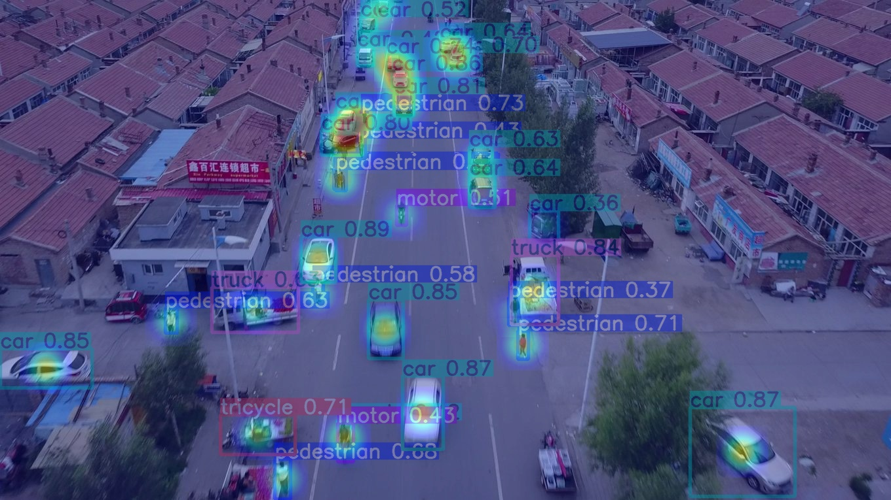

<div align="center">

# 🦅 Kestrel
### AI-Powered UAV Object Detection & Explainable Vision System

<p align="center">
Detect. Explain. Analyze.
</p>

<p align="center">


</p>

---

### 🚀 Intelligent Drone Vision Powered by Deep Learning

Kestrel is an end-to-end UAV object detection system built using **YOLOv8**, designed to detect and analyze aerial objects captured by drones. The project combines state-of-the-art object detection, explainable AI, pseudo-labeling, and an interactive Streamlit dashboard into a complete computer vision pipeline.

</div>

---

# ✨ Features

✅ Custom-trained YOLOv8 object detection model

✅ Drone image & video inference

✅ Interactive Streamlit dashboard

✅ Adjustable confidence threshold

✅ Automatic object counting

✅ Explainable AI using Grad-CAM

✅ Semi-supervised learning using Pseudo Labeling

✅ Custom dataset preprocessing pipeline

✅ Real-time prediction visualization

---

# 📸 Demo

## Upload Image


---

## Detection Results


---

## Grad-CAM Visualization



---

# 🏗️ System Architecture

```text
                 UAV Image / Video
                         │
                         ▼
                Data Preprocessing
                         │
                         ▼
                 YOLOv8 Training
                         │
                         ▼
            Custom Kestrel Model (.pt)
                         │
         ┌───────────────┴───────────────┐
         ▼                               ▼
 Image Detection                  Video Detection
         │                               │
         └───────────────┬───────────────┘
                         ▼
                Explainability (GradCAM)
                         ▼
                Streamlit Web Dashboard
```

---

# 🧠 Technologies Used

| Technology | Purpose |
|------------|---------|
| Python | Programming Language |
| YOLOv8 | Object Detection |
| PyTorch | Deep Learning |
| OpenCV | Image Processing |
| Streamlit | Web Interface |
| Grad-CAM | Explainable AI |
| NumPy | Numerical Computing |
| Matplotlib | Visualization |

---

# 📂 Project Structure

```text
Kestrel/
│
├── app.py
├── train.py
├── predict.py
├── gradcam.py
├── pseudo_label.py
│
├── config.yaml
├── requirements.txt
│
├── models/
│   ├── weights/
│   └── final/
│       ├── baseline_best.pt
│       └── kestrel_final_best.pt
│
├── data/
│   ├── raw/
│   └── processed/
│
├── results/
│   ├── detections/
│   └── heatmaps/
│
└── README.md
```

---

# 🛰️ Dataset

The model was trained using the **VisDrone Dataset**, one of the largest benchmark datasets for UAV-based object detection.

The dataset contains aerial imagery captured from drones under varying conditions including:

- Urban roads
- Residential areas
- Highways
- Crowded streets
- Parking lots
- Different altitudes
- Different lighting conditions

---

# 🎯 Supported Object Classes

The model can detect aerial objects including:

- 🚶 Person
- 🚗 Car
- 🚕 Taxi
- 🚌 Bus
- 🚚 Truck
- 🚲 Bicycle
- 🏍 Motorcycle
- 🚐 Van
- 🚦 Traffic-related objects
- and other VisDrone categories.

---

# 🔥 Explainable AI (Grad-CAM)

Unlike traditional object detectors, Kestrel also explains *why* the model made a prediction.

Grad-CAM generates activation heatmaps highlighting the image regions responsible for each prediction, improving transparency and interpretability.

---

# 📈 Training Pipeline

```
Dataset
   │
   ▼
Annotation Parsing
   │
   ▼
Image Preprocessing
   │
   ▼
YOLOv8 Training
   │
   ▼
Validation
   │
   ▼
Best Model Saved
   │
   ▼
Pseudo Labeling
   │
   ▼
Improved Dataset
```

---

# 💻 Installation

Clone the repository

```bash
git clone https://github.com/yourusername/Kestrel.git

cd Kestrel
```

Create virtual environment

```bash
python -m venv venv
```

Activate

### Windows

```bash
venv\Scripts\activate
```

### macOS/Linux

```bash
source venv/bin/activate
```

Install dependencies

```bash
pip install -r requirements.txt
```

---

# 🚀 Running the Project

Launch the Streamlit dashboard

```bash
streamlit run app.py
```

Train the model

```bash
python train.py
```

Run inference

```bash
python predict.py
```

Generate Grad-CAM

```bash
python gradcam.py
```

Generate pseudo labels

```bash
python pseudo_label.py
```

---

# 📊 Results

| Feature | Status |
|---------|--------|
| Custom YOLOv8 Training | ✅ |
| Streamlit Deployment | ✅ |
| Image Detection | ✅ |
| Video Detection | ✅ |
| Grad-CAM | ✅ |
| Object Counting | ✅ |
| Pseudo Labeling | ✅ |

---

# 🚀 Future Improvements

- Multi-object tracking (ByteTrack / DeepSORT)
- Live webcam inference
- Drone video analytics
- ONNX export
- TensorRT optimization
- Edge deployment
- Real-time FPS monitoring
- Detection report generation
- Model benchmarking
- Cloud deployment

---

# 🤝 Contributing

Contributions are welcome!

If you'd like to improve Kestrel, feel free to fork the repository and submit a pull request.

---

# 📜 License

This project is released under the MIT License.

---

# 👨‍💻 Author

**Sanskar Chouksey**

B.Tech Computer Science Engineering

Artificial Intelligence • Machine Learning • Computer Vision

GitHub: https://github.com/sanskkrr

LinkedIn: https://linkedin.com/in/sanskar-chouksey-51a730362

---

<div align="center">

⭐ If you found this project useful, consider giving it a star.

Built with ❤️ using Python, PyTorch & YOLOv8

</div>